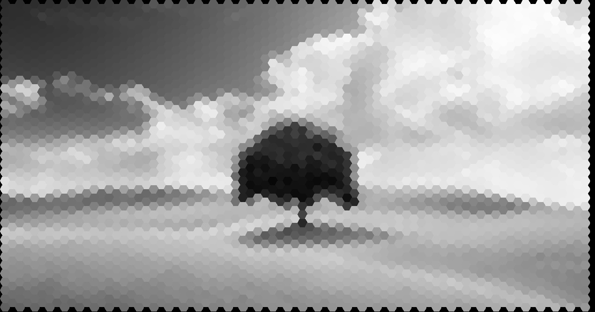

# Infra_assessment

This project is part of the INFRA assessment. This project aims at transforming a grayscale image into a set of hexagons where each hexagons is colored with the mean intensity value of the image within the hexagon (see picture below). 
In other words, we create an image where pixels are hexagons. The code take in input an image and a scaling factor and output an image and the mean intensity values for each hexagons. 


Input image that is converted afterward in grayscale.


## Requirements

This code use opencv, numpy, pandas, math, argparse. All the required packaged are presented in the requirement.txt that you can download with the following line in your terminal
```
pip install requirements.txt
```

## How to use

The code is called main.py. Just run main.py to use the code. Two parameters can be tuned : filename and long_radius. The first one represents the path and name of the image and the second is the radius of the circle that encompass the hexagon.
The higher is the long_radius value and the bigger will be the hexagons.
To run the code, you can use the following line: 

```
py main.py --filename image_test.jpg --long_radius 10
```
Please change the ```py``` following your device, e.g. ```py3```,```python```...
Two images are available for testing the code : "image_test.jpg" and "cameraman.jpg".

## What is the output ? 

The code outputs an image that is saved in the Output directory. It also save the file intensities.csv that contains the mean intensity values of each hexagons as well as the coordinates of their center (X_position,Y_position).
